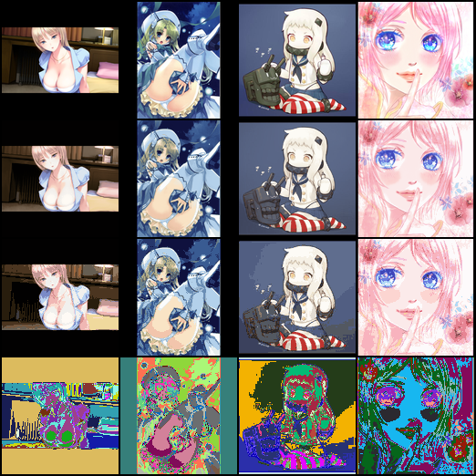

# SimpleRegion

|  | 
|:--:| 
| *From up to down: real images, soft regions, hard regions, hard regions with random colors* |

A simple neural network model for extracting regions from an image.

The result of the model is similar to clustering the pixels of a single image or do a superpixel task.

## Principle

- Neural network classifies image pixels to multiple regions.

- Average the pixels of the original image corresponding to a region to get the average color of the region.

- Assign the average color to the corresponding position in the region.

- During the training process, the classification result is the probability obtained by softmax, not just 0 and 1. This kind of gradient result enables the colors to blend well, thereby generating a soft colored result.

- Replace the maximum value in the classification probability with 1, and replace the remaining values with 0, and then perform coloring to obtain a hard colored image. This looks like clustering an image or generating superpixel regions.

## Training

Run the command line:

```sh
python train.py <YOUR DATASET DIRECTORY>
```

## Use

If you modify this model, it should be used to separate the edges, solid colors, gradients and lighting of an image.

This is just a simple neural network model. If you have a very complicated idea about extracting regions from an image, I recommend you to use the dataset and model of [lllyasviel/DanbooRegion](https://github.com/lllyasviel/DanbooRegion).

## Contact

QQ Group: 1044867291

Discord Channel: https://discord.gg/YwWcAS47qb

## Citation

```
@misc{Wu_Simple_Region_2021,
  author = {Wu, Hecong},
  title = {A Simple Neural Network Model For Extracting Regions From An Image},
  month = {10},
  year = {2021},
  publisher = {GitHub},
  journal = {GitHub repository},
  url = {https://github.com/HighCWu/SimpleRegion},
}
```